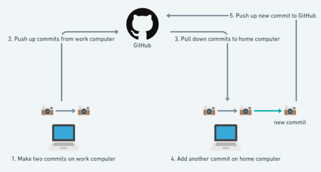
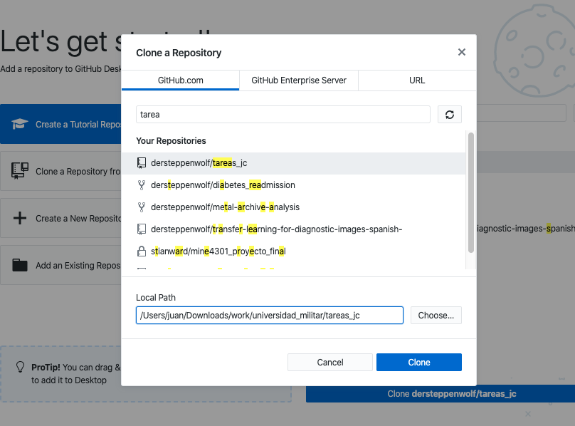
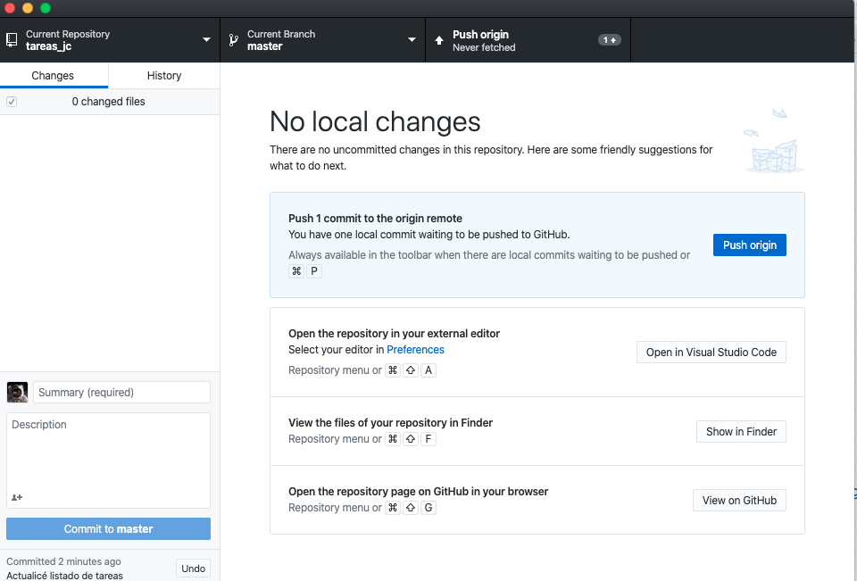
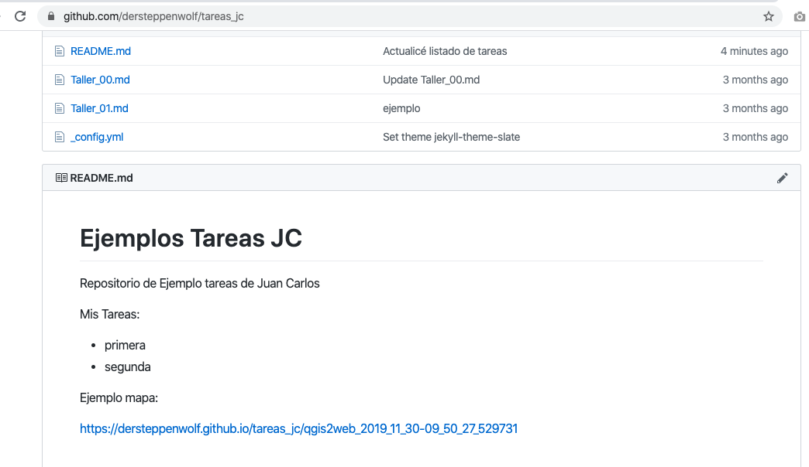
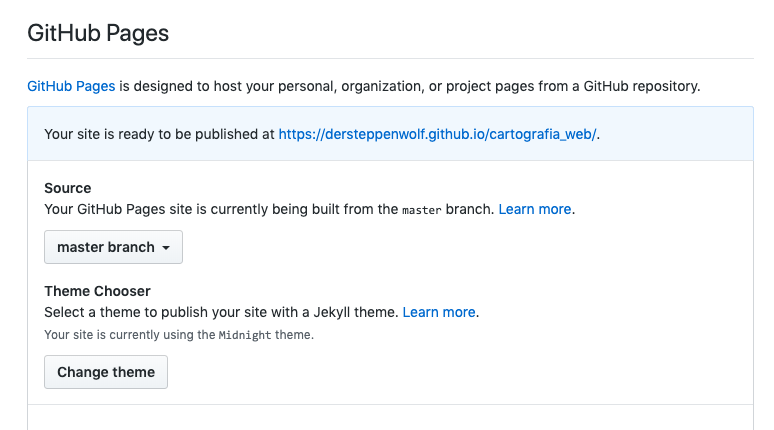

# 1 - Fundamentos de Internet

- [1 - Fundamentos de Internet](#1---fundamentos-de-internet)
  - [Presentación](#presentaci%C3%B3n)
  - [Ejercicio: Publicar página web a través de servidor de Github pages](#ejercicio-publicar-p%C3%A1gina-web-a-trav%C3%A9s-de-servidor-de-github-pages)
  - [Ejercicio 2: Mi primer mapa web](#ejercicio-2-mi-primer-mapa-web)
  - [Ejercicio 3: Publique contenido web utilizando Markdown y Github](#ejercicio-3-publique-contenido-web-utilizando-markdown-y-github)
  - [Enlaces adicionales](#enlaces-adicionales)
    - [Fundamentos Html](#fundamentos-html)
    - [Versionamiento y Colaboración: Git y Github](#versionamiento-y-colaboraci%C3%B3n-git-y-github)
    - [GitHub Pages](#github-pages)
    - [Markdown](#markdown)

## Presentación

Enlace:  

## Ejercicio: Publicar página web a través de servidor de Github pages

**Qué es Git?**

Git es un sistema de control de versiones que permite llevar el registro completo de cambios de un
conjunto de archivos pertenecientes a un proyecto.  (Histórico de cambios)

Permite hacer comparaciones entre versiones de archivos basados en texto. (Ejm páginas html, código javascript, código python, etc)

Las operaciones principales realizadas en los repositorios git son las siguientes:

- Copiar repositorio remoto en la máquina local (clone)
- Adicionar / Eliminar / Modificar archivo  (add)
- Confirmar cambios (commit)
- Traer los cambios desde un repositorio remoto (pull)
- Enviar cambios a repositorio remoto (push)

**Qué es Github ?**

Github es un servicio que permite la publicación y administración de repositorios Git en línea.

La disposición en línea facilita el trabajo colaborativo entre personas (Ejm. desarrolladores ) 

Github permite realizar el reporte de __"issues"__ (asuntos)  sobre reporte de errores, solicitud de cambios, etc.

Un repositorio en Github es similar a la carpeta de un proyecto que además de contener los archivos permite realizar el seguimiento histórico de los mismos.

**Para qué vamos a utilizar Github en la clase?**

A través de esta herramienta los estudiantes publicarán los archivos de sus tareas (Ejm. páginas html, js,etc).

**Crear repositorio**

Realizar lo siguiente: 

- Crear una cuenta gratuita en github https://github.com/
- Crear un repositorio en Github (ejm: __tareas_jc__  )teniendo en  cuenta lo siguiente:
  - Cada estudiante debe crear su propio repositorio.  A travès de este repositorio se realizará la entrega de las tareas.  
    - Ejemplos 
      - https://github.com/dersteppenwolf/tareas_jc
      - https://github.com/jenny-saray/Jenny_Saray/blob/master/Tarea3.md 
  - Debe ser **público**  
  - Inicializar archivo Readme.md
  - Licencia MIT / Creative Commons
- Proceso paso a paso para la creación del repositorio a través de la interfaz web https://help.github.com/es/github/getting-started-with-github/create-a-repo

**Qué es Github Desktop ?**

Github Desktop es una herramienta de escritorio que facilita la publicación y sincronización de archivos en repositorios git (push, pull, commit).

Realizar lo siguiente: 

- Instalar Github Desktop https://desktop.github.com/
- Guía: Instalación y Uso de GitHub Desktop https://luismasdev.com/instalacion-y-uso-de-github-desktop/
- "Clone" en su máquina el repositorio que creó en github (ejm: __tareas_jc__  )

- Edite el archivo **Readme.md**  y confirme los cambios en el repositorio de github (commit)
  

- Sincronice los cambios locales con el servicio en línea de github (push)

- Ingrese a la página web de su proyecto (ejm. https://github.com/dersteppenwolf/tareas_jc) y verifique que en servicio en línea de github se encuentran ya disponibles los cambios realizados

- Ubique en su sistema de archivos donde se encuentra descargado el repositorio: Ejm: /Users/juan/Downloads/work/universidad_militar/tareas_jc
- Dentro de ese proyecto cree una carpeta llamada "ejercicio_01"
- Dentro de la carpeta "ejercicio_01" cree una página html básica llamada "hello.html"
- Publique los nuevos archivos en github y verifique que se encuentran disponibles en github.com

- Si lo desea también puede crear nuevos repositorios mediante GitHub Desktop https://help.github.com/es/desktop/getting-started-with-github-desktop/creating-your-first-repository-using-github-desktop

**Qué es Github Pages?**

GitHub Pages es un sistema de publicación de contenido web a través de GitHub.

Con GitHub Pages es posible publicar de forma sencilla un sitio web con archivos almacenados en repositorios git. 

GitHub automáticamente se encarga de publicar automáticamente los contenidos en un servidor web.

A través de GitHub Pages podremos lograr de forma fácil que nuestros archivos (ejm. páginas html) queden disponibles a través de un servidor web.

Realizar lo siguiente: 

- Habilitar Github Pages en su repositorio: 

- Github asigna un Url a la Página principal de su repositorio. 
  - Ejemplos
    -  https://dersteppenwolf.github.io/cartografia_web/
    -  https://dersteppenwolf.github.io/tareas_jc/

- Url de la página html a través del servidor web administrado por github:
https://dersteppenwolf.github.io/tareas_jc/ejercicio_01/hello.html 
- Vista del Código fuente de la página html:
https://github.com/dersteppenwolf/tareas_jc/blob/master/ejercicio_01/hello.html 

**Qué es el sistema de Issues de Github?**

Las propuestas ("issues") permiten rastrear ideas, mejoras, tareas o errores para el trabajo en GitHub.
A través de ellas se puede recopilar opiniones del usuario, informar errores de software y organizar tareas que se quieran realizar para un repositorio. Las propuestas pueden actuar como más que un simple lugar para informar errores de software. https://help.github.com/es/github/managing-your-work-on-github/about-issues

- Ejemplos: 
  - https://github.com/CrunchyData/pg_tileserv/issues
  - https://github.com/sacridini/GEET/issues

Para nuestra clase se realizará la entrega de los ejercicios y tareas a través de issues creados en github.

Realizar lo siguiente: 

- Crear un issue en https://github.com/dersteppenwolf/cartografia_web/issues con lo siguiente:
  - Título: Ejercicio 1 - CODIGO_ESTUDIANTE
  - Contenido: 
    - Enlace al repositorio creado durante el ejercicio
    - Enlace público a la página "hello.html" publicada a través de github pages.
  - Ejemplo: https://github.com/dersteppenwolf/cartografia_web/issues/36 

## Ejercicio 2: Mi primer mapa web

Leaflet (https://leafletjs.com/) es una librería open source de javascript que permite publicar mapas interactivos de forma sencilla.

Ejemplo visor simple con leaflet: 
- vista pública: 
- código fuente: 

- Crear un issue en https://github.com/dersteppenwolf/cartografia_web/issues con lo siguiente:
  - Título: Ejercicio 3 - CODIGO_ESTUDIANTE
  - Contenido: 
    - Enlace al archivo **Readme.md** publicado en github (vista html generada por github)

## Ejercicio 3: Publique contenido web utilizando Markdown  y Github 

**Qué es markdown?**

La sintaxis de html es algo compleja para los humanos.

Markdown es una herramienta de conversión de texto plano a HTML.

La idea general es que el autor crea el contenido con texto sencillo basado en la sintaxis de mardown y un programa se encarga de convertirlo a su equivalente Html.  

Qué es markdown https://markdown.es/

Ejemplo:
- Texto Markdown de página web: https://raw.githubusercontent.com/dersteppenwolf/cartografia_web/master/README.md
- Vista html de la página a través de github: https://github.com/dersteppenwolf/cartografia_web/blob/master/README.md
- Vista html de la página a través de github pages con plantilla de diseño : https://dersteppenwolf.github.io/cartografia_web/

Ejemplos de presentación de repositorios en github:

- Explore Worldwide Female Educational Opportunities https://github.com/Divyaraaga/w209-datavis-project
- Visual analytics https://github.com/dersteppenwolf/isis4822
- Dashboard to analyze Rheumatoid Arthritis in Colombia based on Costs per Person https://github.com/dersteppenwolf/isis4822_final_project
- We know what you did - An analysis on Colombia congressman financial assests https://github.com/cjcarvajal/cuestion-publica-analysis
- How does Bogota vote? https://github.com/vgarzom/va-votacion-bogota

Realizar lo siguiente: 

- Edite el archivo **Readme.md** e ingrese sus datos de presentación personal. (Ejm: nombres, temáticas de interés, enlaces a trabajos personales, artículos, etc)
- Utilice diferentes elementos para formateado tales como por ejemplo listas, imágenes, negrilla, etc.
- Crear un issue en https://github.com/dersteppenwolf/cartografia_web/issues con lo siguiente:
  - Título: Ejercicio 3 - CODIGO_ESTUDIANTE
  - Contenido: 
    - Enlace al archivo **Readme.md** publicado en github (vista html generada por github)

## Enlaces adicionales

### Fundamentos Html

- HTML5 Tutorial https://www.w3schools.com/html/
- JavaScript Tutorial https://www.w3schools.com/js/default.asp
- CSS Tutorial https://www.w3schools.com/css/default.asp

### Versionamiento y Colaboración: Git y Github

- Git and GitHub: A Guide for Beginners https://www.coursereport.com/blog/what-is-github
- Github hello world https://guides.github.com/activities/hello-world/
- Introducción a Git y Github https://desarrolloweb.com/articulos/introduccion-git-github.html
- Github: Hello world https://guides.github.com/activities/hello-world/
- An Intro to Git and GitHub for Beginners (Tutorial) https://product.hubspot.com/blog/git-and-github-tutorial-for-beginners
- Introducción al control de versiones con GitHub Desktop https://programminghistorian.org/es/lecciones/introduccion-control-versiones-github-desktop
- La comodidad de TortoiseGit, instalación y manejo http://carmoreno.github.io/tutoriales/2016/04/14/TortoiseGit-Instalacion-y-uso/
- Adding a file to a repository https://help.github.com/en/articles/adding-a-file-to-a-repository
- Tortoise git (https://carmoreno.github.io/tutoriales/2016/04/14/TortoiseGit-Instalacion-y-uso/) para sincronizar más fácilmente los archivos en github.

### GitHub Pages

- Getting Started with GitHub Pages https://guides.github.com/features/pages/
- Publicar tu web usando GitHub Pages https://devcode.la/tutoriales/publicar-tu-web-usando-github-pages/
- How to create open educational resources with Jekyll and GitHub Pages https://localpreservation.github.io/how-to-open-education-jekyll-github-pages/

### Markdown

- Qué es Markdown, para qué sirve y cómo usarlo https://www.genbeta.com/guia-de-inicio/que-es-markdown-para-que-sirve-y-como-usarlo
- Markdown tutorial https://www.markdowntutorial.com/

- Markdown Cheatsheet https://github.com/adam-p/markdown-here/wiki/Markdown-Cheatsheet
- Markdown quick reference cheat sheet https://en.support.wordpress.com/markdown-quick-reference/