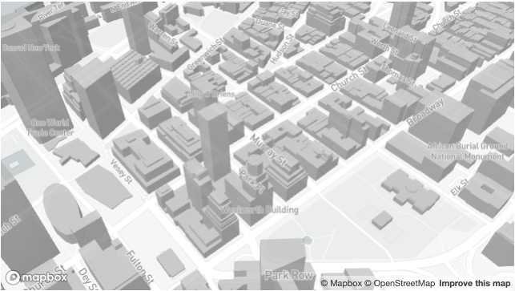

# Simbología para Mapas Web

- [Simbología para Mapas Web](#simbolog%C3%ADa-para-mapas-web)
  - [SLD](#sld)
  - [Mapserver](#mapserver)
  - [Arcgis Server](#arcgis-server)
  - [Geoserver](#geoserver)
    - [Básico](#b%C3%A1sico)
    - [Avanzado](#avanzado)
  - [Vector tiles](#vector-tiles)

## SLD

Styled Layer Descriptor https://www.opengeospatial.org/standards/sld

    The OpenGIS® Styled Layer Descriptor (SLD) Profile of the OpenGIS® Web Map Service (WMS)
    Encoding Standard [http://www.opengeospatial.org/standards/wms] defines
    an encoding that extends
     the WMS standard to allow user-defined symbolization
    and coloring of geographic feature[http://www.opengeospatial.org/ogc/glossary/f]
    and coverage[http://www.opengeospatial.org/ogc/glossary/c] data.

https://en.wikipedia.org/wiki/Styled_Layer_Descriptor

    In cartography, a Styled Layer Descriptor (SLD) is an XML
    schema specified by the Open Geospatial Consortium (OGC)
    for describing the appearance of map layers.
    It is capable of describing the rendering of vector and raster data.
    A typical use of SLDs is to instruct a Web Map Service (WMS)
    how to render a specific layer.

Ejemplo:

```xml
<?xml version="1.0" encoding="UTF-8"?>
<StyledLayerDescriptor version="1.1.0"
  xmlns="http://www.opengis.net/sld"
  xmlns:se="http://www.opengis.net/se"
  xmlns:ogc="http://www.opengis.net/ogc"
  xmlns:xlink="http://www.w3.org/1999/xlink"
  xmlns:xsi="http://www.w3.org/2001/XMLSchema-instance"
  xsi:schemaLocation="http://www.opengis.net/sld
  http://schemas.opengis.net/sld/1.1.0/StyledLayerDescriptor.xsd">
<NamedLayer>
  <se:Name>country_bounds</se:Name>
    <UserStyle>
      <se:Name>xxx</se:Name>
      <se:FeatureTypeStyle>
        <se:Rule>
          <se:LineSymbolizer>
            <se:Geometry>
              <ogc:PropertyName>center-line</ogc:PropertyName>
            </se:Geometry>
            <se:Stroke>
              <se:SvgParameter name="stroke">#0000ff</se:SvgParameter>
            </se:Stroke>
          </se:LineSymbolizer>
        </se:Rule>
      </se:FeatureTypeStyle>
    </UserStyle>
  </NamedLayer>
</StyledLayerDescriptor>
```

## Mapserver

SLD https://mapserver.org/ogc/sld.html

## Arcgis Server

- Utilizar descriptores de capa con estilo con servicios WMS https://enterprise.arcgis.com/es/server/latest/publish-services/windows/using-styled-layer-descriptors-with-wms-services.htm

```xml
<sld:StyledLayerDescriptor version="1.0.0" xsi:schemaLocation="http://www.opengis.net/sld http://schemas.opengis.net/sld/1.0.0/StyledLayerDescriptor.xsd">
 <!--
  ESRI_StatesCitiesRivers_USA @
  http://sampleserver1.arcgisonline.com/arcgis/services/Specialty/ESRI_StatesCitiesRivers_USA/MapServer/WMSServer?
 -->
 <sld:NamedLayer>
  <!--
   layer "2" is the "cities" point layer in the WMS service
  -->
  <sld:Name>2</sld:Name>
  <sld:UserStyle>
   <!--
    style should be applied on layer "2", reference the style by it's name "pointSymbolizer"
   -->
   <sld:Name>pointSymbolizer</sld:Name>
   <sld:Title>pointSymbolizer</sld:Title>
   <sld:FeatureTypeStyle>
    <sld:Rule>
     <sld:PointSymbolizer>
      <sld:Graphic>
       <sld:Mark>
        <!-- uses a circle to mark a city -->
        <sld:WellKnownName>circle</sld:WellKnownName>
        <!-- fill circle with color #666666 -->
        <sld:Fill>
         <sld:CssParameter name="fill">#666666</sld:CssParameter>
         <sld:CssParameter name="fill-opacity">1</sld:CssParameter>
        </sld:Fill>
        <!-- circle boundary with color #666666 -->
        <sld:Stroke>
         <sld:CssParameter name="stroke">#666666</sld:CssParameter>
         <sld:CssParameter name="stroke-opacity">1</sld:CssParameter>
         <sld:CssParameter name="stroke-width">1</sld:CssParameter>
        </sld:Stroke>
       </sld:Mark>
       <!-- circle opacity 1.0 -->
       <sld:Opacity>1</sld:Opacity>
       <!-- circle size "3" -->
       <sld:Size>3</sld:Size>
       <sld:Rotation>0</sld:Rotation>
      </sld:Graphic>
     </sld:PointSymbolizer>
    </sld:Rule>
   </sld:FeatureTypeStyle>
  </sld:UserStyle>
 </sld:NamedLayer>
</sld:StyledLayerDescriptor>
```

- Muestras del Descriptor de capa con estilo (SLD) de WMS https://enterprise.arcgis.com/es/server/latest/publish-services/windows/wms-styled-layer-descriptor-sld-samples.htm

##  Geoserver

### Básico

- Geoserver Styling https://docs.geoserver.org/stable/en/user/styling/index.html
- SLD Styling https://docs.geoserver.org/stable/en/user/styling/sld/index.html
- Generating SLD styles with QGIS https://docs.geoserver.org/stable/en/user/styling/qgis/index.html
- CSS Styling https://docs.geoserver.org/stable/en/user/styling/css/index.html
- Geoserver: Optimize Styling https://es.slideshare.net/geosolutions/geoserver-on-steroids/35
- YSLD Styling https://docs.geoserver.org/stable/en/user/styling/ysld/index.html
- MBStyle Styling https://docs.geoserver.org/stable/en/user/styling/mbstyle/index.html
- Styling workshop https://docs.geoserver.org/stable/en/user/styling/workshop/index.html

### Avanzado

- Creating Stunning Maps in GeoServer: mastering SLD and CSS styles https://es.slideshare.net/geosolutions/creating-stunning-maps-in-geoserver-mastering-sld-and-css-styles-foss4g-2016

- Advanced Cartographic Map Rendering in GeoServer https://es.slideshare.net/geosolutions/advanced-cartographic-map-rendering-in-geoserver-50703958

## Vector tiles

- Ejemplo: Change a map's style https://docs.mapbox.com/mapbox-gl-js/example/setstyle/


- Ejemplo: Display buildings in 3D https://docs.mapbox.com/mapbox-gl-js/example/3d-buildings/



- Diferencias entre teselas raster y vector https://es.slideshare.net/bolosig/del-wms-al-vector-tiles/13
- Mapbox Vector tiles https://docs.mapbox.com/vector-tiles/reference/

  Vector tiles are an **open standard** under a
  **Creative Commons Attribution 3.0** US License.

- Mapbox Vector Tile specification

  - https://docs.mapbox.com/vector-tiles/specification/
  - https://github.com/mapbox/vector-tile-spec

- Ejemplo: Mapbox Streets v8 https://docs.mapbox.com/vector-tiles/reference/mapbox-streets-v8/

```json
{
  "version": 8,
  "name": "Mapbox Streets tileset v8",
  "sources": {
    "mapbox-streets": {
      "type": "vector",
      "url": "mapbox://mapbox.mapbox-streets-v8"
    }
  },
  "layers": [
    {
      "id": "admin",
      "source": "mapbox-streets",
      "source-layer": "admin",
      "type": "line",
      "paint": {
        "line-color": "#ffffff"
      }
    },
    {
      "id": "aeroway",
      "source": "mapbox-streets",
      "source-layer": "aeroway",
      "type": "line",
      "paint": {
        "line-color": "#ffffff"
      }
    },
    {
      "id": "airport_label",
      "source": "mapbox-streets",
      "source-layer": "airport_label",
      "type": "circle",
      "paint": {
        "circle-radius": 3,
        "circle-color": "rgba(238,78,139, 0.4)",
        "circle-stroke-color": "rgba(238,78,139, 1)",
        "circle-stroke-width": 1
      }
    },
    {
      "id": "building",
      "source": "mapbox-streets",
      "source-layer": "building",
      "type": "fill",
      "paint": {
        "fill-color": "rgba(66,100,251, 0.3)",
        "fill-outline-color": "rgba(66,100,251, 1)"
      }
    },
    {
      "id": "housenum_label",
      "source": "mapbox-streets",
      "source-layer": "housenum_label",
      "type": "circle",
      "paint": {
        "circle-radius": 3,
        "circle-color": "rgba(238,78,139, 0.4)",
        "circle-stroke-color": "rgba(238,78,139, 1)",
        "circle-stroke-width": 1
      }
    },
    {
      "id": "landuse_overlay",
      "source": "mapbox-streets",
      "source-layer": "landuse_overlay",
      "type": "fill",
      "paint": {
        "fill-color": "rgba(66,100,251, 0.3)",
        "fill-outline-color": "rgba(66,100,251, 1)"
      }
    },
    {
      "id": "landuse",
      "source": "mapbox-streets",
      "source-layer": "landuse",
      "type": "fill",
      "paint": {
        "fill-color": "rgba(66,100,251, 0.3)",
        "fill-outline-color": "rgba(66,100,251, 1)"
      }
    },
    {
      "id": "motorway_junction",
      "source": "mapbox-streets",
      "source-layer": "motorway_junction",
      "type": "circle",
      "paint": {
        "circle-radius": 3,
        "circle-color": "rgba(238,78,139, 0.4)",
        "circle-stroke-color": "rgba(238,78,139, 1)",
        "circle-stroke-width": 1
      }
    },
    {
      "id": "natural_label",
      "source": "mapbox-streets",
      "source-layer": "natural_label",
      "type": "circle",
      "paint": {
        "circle-radius": 3,
        "circle-color": "rgba(238,78,139, 0.4)",
        "circle-stroke-color": "rgba(238,78,139, 1)",
        "circle-stroke-width": 1
      }
    },
    {
      "id": "place_label",
      "source": "mapbox-streets",
      "source-layer": "place_label",
      "type": "circle",
      "paint": {
        "circle-radius": 3,
        "circle-color": "rgba(238,78,139, 0.4)",
        "circle-stroke-color": "rgba(238,78,139, 1)",
        "circle-stroke-width": 1
      }
    },
    {
      "id": "poi_label",
      "source": "mapbox-streets",
      "source-layer": "poi_label",
      "type": "circle",
      "paint": {
        "circle-radius": 3,
        "circle-color": "rgba(238,78,139, 0.4)",
        "circle-stroke-color": "rgba(238,78,139, 1)",
        "circle-stroke-width": 1
      }
    },
    {
      "id": "road",
      "source": "mapbox-streets",
      "source-layer": "road",
      "type": "line",
      "paint": {
        "line-color": "#ffffff"
      }
    },
    {
      "id": "structure",
      "source": "mapbox-streets",
      "source-layer": "structure",
      "type": "fill",
      "paint": {
        "fill-color": "rgba(66,100,251, 0.3)",
        "fill-outline-color": "rgba(66,100,251, 1)"
      }
    },
    {
      "id": "transit_stop_label",
      "source": "mapbox-streets",
      "source-layer": "transit_stop_label",
      "type": "circle",
      "paint": {
        "circle-radius": 3,
        "circle-color": "rgba(238,78,139, 0.4)",
        "circle-stroke-color": "rgba(238,78,139, 1)",
        "circle-stroke-width": 1
      }
    },
    {
      "id": "water",
      "source": "mapbox-streets",
      "source-layer": "water",
      "type": "fill",
      "paint": {
        "fill-color": "rgba(66,100,251, 0.3)",
        "fill-outline-color": "rgba(66,100,251, 1)"
      }
    },
    {
      "id": "waterway",
      "source": "mapbox-streets",
      "source-layer": "waterway",
      "type": "line",
      "paint": {
        "line-color": "#ffffff"
      }
    }
  ]
}
```

- OGC Calls for Participation in Vector Tiles Pilot https://www.opengeospatial.org/pressroom/pressreleases/2837

  The Open Geospatial Consortium (OGC) has released a Call
  for Participation to solicit proposals for the OGC Vector Tiles Pilot Initiative.

  The Vector Tiles Pilot, sponsored by the US Army Geospatial
  Center and the UK Defence Science and Technology Laboratory
  (Dstl) will advance an OGC approach to encode and publish Vector Tiles,
  and will propose extensions for WFS, WMTS, and GeoPackage.

- awesome implementations of the Mapbox Vector Tile specification https://github.com/mapbox/awesome-vector-tiles

* Vector Tiles with GeoServer and OpenLayers https://es.slideshare.net/jgarnett/vector-tiles-with-geoserver-and-openlayers
* Geoserver Vector tiles tutorial https://docs.geoserver.org/latest/en/user/extensions/vectortiles/tutorial.html
