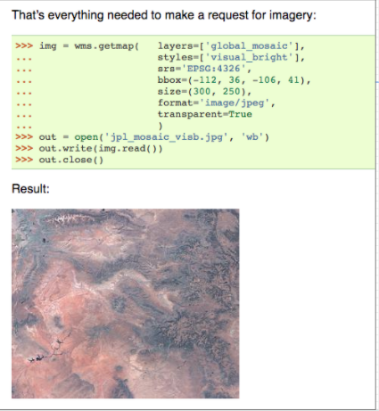

# Servicios web, geoservicios y OGC

- [Servicios web, geoservicios y OGC](#servicios-web-geoservicios-y-ogc)
  - [Presentación](#presentaci%C3%B3n)
  - [Ejercicio 1: Consumiendo servicios WMS con clientes de escritorio](#ejercicio-1-consumiendo-servicios-wms-con-clientes-de-escritorio)
  - [Ejercicio 2: Consumiendo servicios WMS con clientes ligeros](#ejercicio-2-consumiendo-servicios-wms-con-clientes-ligeros)
  - [Ejercicio 3: Servicios OGC y Python](#ejercicio-3-servicios-ogc-y-python)

## Presentación

Enlace https://github.com/dersteppenwolf/cartografia_web/blob/master/02_Servicios_Web_Geoservicios_OGC/02_%20Servicios_web_geoservicios_OGC.pdf

## Ejercicio 1: Consumiendo servicios WMS con clientes de escritorio

A través de clientes SIG de escritorio como QGIS o Arcgis Desktop / pro puede consumir servicios OGC WMS y WFS

Realizar lo siguiente: 

- Ubique un servicio WMS de una entidad colombiana.  Ejemplos:
  - IGAC
    - https://geoportal.igac.gov.co/contenido/geoservicios 
    - https://geoportal.igac.gov.co/contenido/datos-abiertos-cartografia-y-geografia
  - Datos Abiertos Bogotá https://datosabiertos.bogota.gov.co/dataset?res_format=WMS
- Visualice el servicio wms que seleccionó a través de QGIS.  ( __Qgis Working with WMS Data__ http://www.qgistutorials.com/en/docs/working_with_wms.html  ).  
- Explore el mapa utilizando las herramientas de "zoom" y "pan". Ubique una zona de interés, preferiblemente no tan grande. 
- Ubique un servicio WFS de una entidad colombiana.  Ejemplos:
  - IGAC
    - https://geoportal.igac.gov.co/contenido/geoservicios 
    - https://geoportal.igac.gov.co/contenido/datos-abiertos-cartografia-y-geografia
  - Datos Abiertos Bogotá https://datosabiertos.bogota.gov.co/dataset?res_format=WFS
- Adicione la capa WFS de interés a QGIS (__WFS and WFS-T Client__  https://docs.qgis.org/3.10/en/docs/user_manual/working_with_ogc/ogc_client_support.html#wfs-and-wfs-t-client ) y asígnele una simbología.
- Genere un pdf de una zona de interés donde se puedan visualizar tanto los datos provenientes del WMS como los del WFS.
- Repita el ejercicio utilizando Arcgis Desktop o Arcgis Pro  
  - __Arcgis Desktop Adding WMS services__ http://desktop.arcgis.com/en/arcmap/latest/map/web-maps-and-services/adding-wms-services.htm 
  - __Adding a WFS service to ArcMap__ https://desktop.arcgis.com/en/arcmap/latest/map/web-maps-and-services/adding-a-wfs-service-to-arcmap.htm
  - __Arcgis Pro: Agregar servicios WFS__ https://pro.arcgis.com/es/pro-app/help/data/services/add-wfs-services.htm
- Suba los dos pdfs generados a su repositorio de Github. Comparta los urls de los geoservicios utilizados y los pdfs generados a través del chat de la clase.
  

## Ejercicio 2: Consumiendo servicios WMS con clientes ligeros

Otras herramientas: 
- Visor WMS Esri Js https://developers.arcgis.com/javascript/3/samples/layers_wms/
- Mapbox Gl https://www.mapbox.com/mapbox-gl-js/example/wms/
- Carto https://carto.com/learn/guides/styling/inserting-external-basemaps/

## Ejercicio 3: Servicios OGC y Python

**OWSLib** 
http://geopython.github.io/OWSLib/ 
Librería de python para el desarrollo de clientes para servicios web basados en Open Geospatial Consortium (OGC) 

**Google Colaboratory**

**Colaboratory** es un entorno gratuito de Jupyter Notebook que no requiere configuración y que se ejecuta completamente en la nube.

Ejemplo de OWSLib utilizando Google Colaboratory  https://colab.research.google.com/drive/1S1UygmFjZIFswq8gtMxuYoX571vdI2KR

