# Servicios en la nube
- [Servicios en la nube](#servicios-en-la-nube)
  - [Presentación](#presentaci%C3%B3n)
- [Publicando mapas utilizando servicios en la nube](#publicando-mapas-utilizando-servicios-en-la-nube)
  - [Introducción: Historias contadas con Mapas](#introducci%C3%B3n-historias-contadas-con-mapas)
  - [Prerrequisitos](#prerrequisitos)
  - [Ejercicio 1: Mapa de coropletas (choropleth) con Mapbox studio](#ejercicio-1-mapa-de-coropletas-choropleth-con-mapbox-studio)
  - [Ejercicio 2: Introducción a Carto](#ejercicio-2-introducci%C3%B3n-a-carto)
  - [Ejercicio 3: Crear dashboard interactivo para el análisis de tweets](#ejercicio-3-crear-dashboard-interactivo-para-el-an%C3%A1lisis-de-tweets)
  - [Ejercicio 4: Agregaciones / Densidad con Carto](#ejercicio-4-agregaciones--densidad-con-carto)
  - [Ejercicio 5: Mapa de coropletas (choropleth) con Carto](#ejercicio-5-mapa-de-coropletas-choropleth-con-carto)
  - [Ejercicio 6: Análisis espacial básico con Carto](#ejercicio-6-an%C3%A1lisis-espacial-b%C3%A1sico-con-carto)
  - [Ejercicio 7: Enriquecer los datos con Análisis espacial utilizando Carto](#ejercicio-7-enriquecer-los-datos-con-an%C3%A1lisis-espacial-utilizando-carto)
  - [Ejercicio 8: Carto y Spatial SQL](#ejercicio-8-carto-y-spatial-sql)
  - [Ejercicio 9: Carto y Spatial SQL - Simplificación de Geometrías](#ejercicio-9-carto-y-spatial-sql---simplificaci%C3%B3n-de-geometr%C3%ADas)
  - [Ejercicio 10: Carto y Spatial SQL - Generación de geometrías](#ejercicio-10-carto-y-spatial-sql---generaci%C3%B3n-de-geometr%C3%ADas)
  - [Ejercicio 11: Arcgis Online (Introducción)](#ejercicio-11-arcgis-online-introducci%C3%B3n)

## Presentación

Enlace https://github.com/dersteppenwolf/cartografia_web/blob/master/07_Servicios_Cloud/07_Servicios_en_la_nube.pdf


# Publicando mapas utilizando servicios en la nube

## Introducción: Historias contadas con Mapas

* The Impact of Brooklyn's L Train Shutdown, in 4 Maps https://www.citylab.com/transportation/2016/07/the-impact-of-nycs-l-train-shutdown-in-4-maps/493115/
* The L Train Closure—what Data Can Tell Us https://carto.com/blog/looking-at-the-l/
* 12 Maps That Tell the Story of 2017 https://carto.com/blog/maps-tell-the-story-2017/
* Immigration. Le Centre-Bretagne à contresens http://www.letelegramme.fr/dataspot/immigration-le-centre-bretagne-a-contresens-20-04-2016-11037935.php#EuBizhJQ4bA6IPlj.99
* Anti-eviction Mapping Project and Carto Expose Realities of Gentrification and Evictions in San Francisco https://carto.com/blog/anti-eviction-mapping/
* Mapping City Data Shows Link Between Redlining and Foreclosures https://carto.com/blog/mapping-city-data-shows-link-between-redlining-and-foreclosures/
* Exploring real-time hurricane evacuation patterns https://blog.mapbox.com/exploring-real-time-hurricane-evacuation-patterns-d7a6199f77db
* Global Warming with a Flourish http://googlemapsmania.blogspot.com.co/2018/03/global-warming-with-flourish.html
* Who owns England? http://googlemapsmania.blogspot.com.co/2018/02/who-owns-england.html
* Where can you afford to rent in California? http://www.latimes.com/projects/la-fi-california-rental-affordable-map/
* Strava’s fitness heatmaps are a 'potential catastrophe' https://www.engadget.com/2018/02/02/strava-s-fitness-heatmaps-are-a-potential-catastrophe/
* Mapped: the best places to live in England and Wales https://www.telegraph.co.uk/finance/economics/11041812/Mapped-the-best-places-to-live-in-England-and-Wales.html
* America's Wall. http://www.kpbs.org/news/2017/nov/13/americas-wall/#explore

## Prerrequisitos

Tener cuenta (gratuita / trial) en los siguientes servicios en la nube:

* Mapbox
* Carto
* Arcgis Online


## Ejercicio 1: Mapa de coropletas (choropleth)  con Mapbox studio

* Datos: datos/stateData.geojson 
  * (Population density across US state (GeoJSON file is borrowed from the Leaflet choropleth tutorial https://leafletjs.com/examples/choropleth/ ) 
* Tutorial : "Make a choropleth map, Part 1: create a style" https://www.mapbox.com/help/choropleth-studio-gl-pt-1/

Resultado

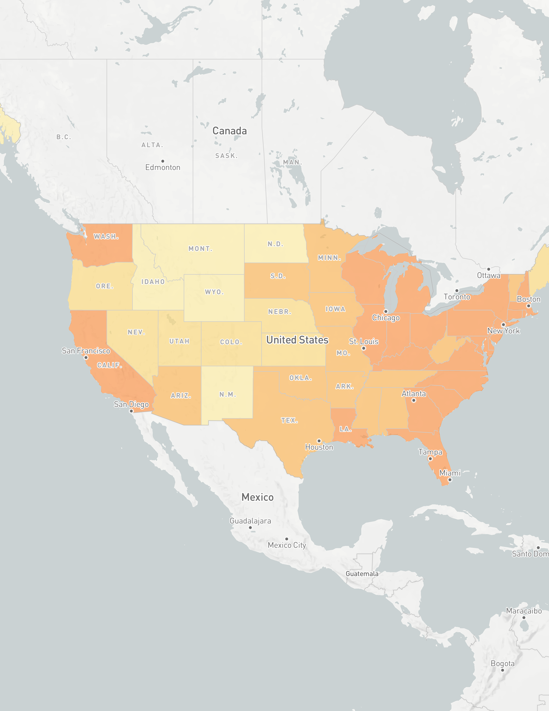


## Ejercicio 2: Introducción a Carto 

* Datos: Tweets Georreferenciados en Colombia recopilados del  19 al 28 de febrero de 2018 :   
  * tweets_2018_shp.zip

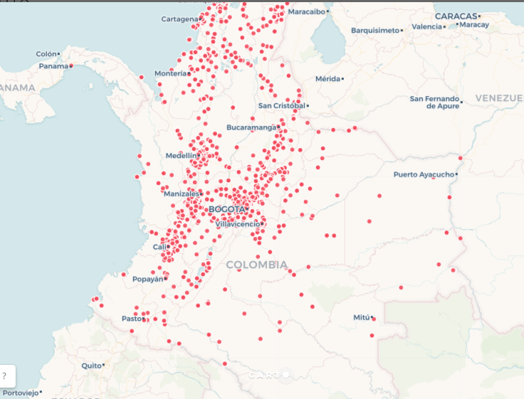

* Departamentos : MGN_ADM_MPIO_POLITICO.zip

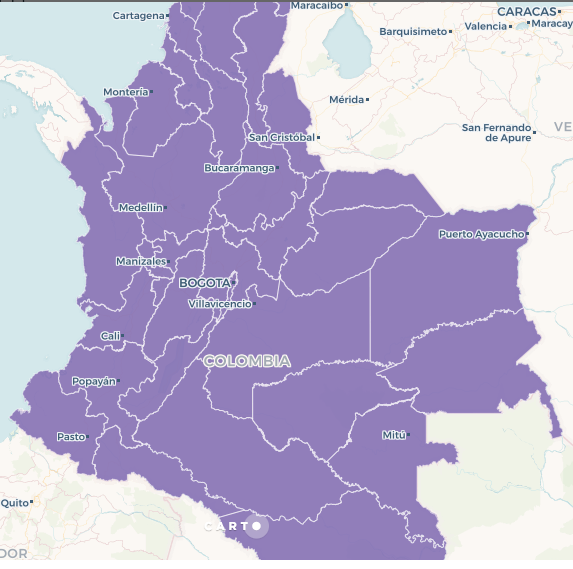

* Municipios: mgn_adm_mpio_politico_simplified_1.zip

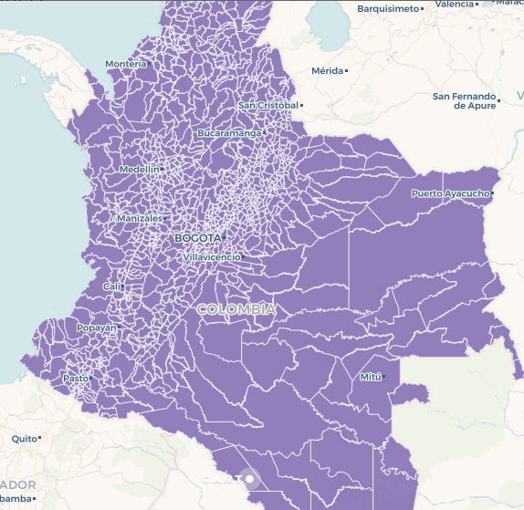


Documentación: 

* How CARTO works  https://carto.com/help/getting-started/
* Video - Tutorial de Carto: crear un mapa a partir de datos procedentes de Open Data https://www.youtube.com/watch?v=1srIH83awvA 
* Video - Analysis with CARTO https://www.youtube.com/watch?v=S_kNe24cO18
* Video - Carto: CartoCSS  https://www.youtube.com/watch?v=pOT5rdyp4N0
* Video - Learning CartoCSS with CARTO  https://www.youtube.com/watch?v=NkX3f-V87QU
* Video - SQL in Carto https://www.youtube.com/watch?v=XaZrKti3G-8
* Carto builder https://carto.com/help/tutorials/getting-started-with-carto-builder/
* Understanding Map Layers in Builder https://carto.com/help/tutorials/understanding-map-layers-in-builder/
* Your Dashboard Overview  https://carto.com/help/tutorials/your-dashboard-overview/
* Using builder https://carto.com/help/tutorials/using-builder/
* Add Columns from 2nd Dataset https://carto.com/help/tutorials/add-columns-from-2nd-dataset/
* Intersect and Aggregate https://carto.com/help/tutorials/intersect-and-aggregate/
* Builder Widgets Overview https://carto.com/help/tutorials/builder-widgets-overview/

Realizar lo siguiente: 

* Cargar datos en Carto

* Visualizar estructura de dataset

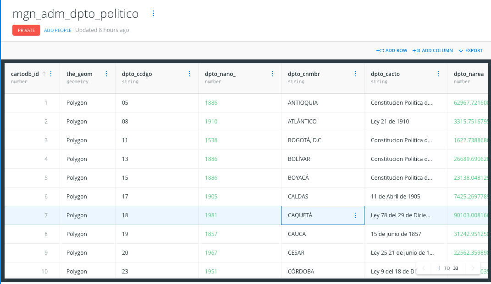


**Tip: Arquitectura de Carto**

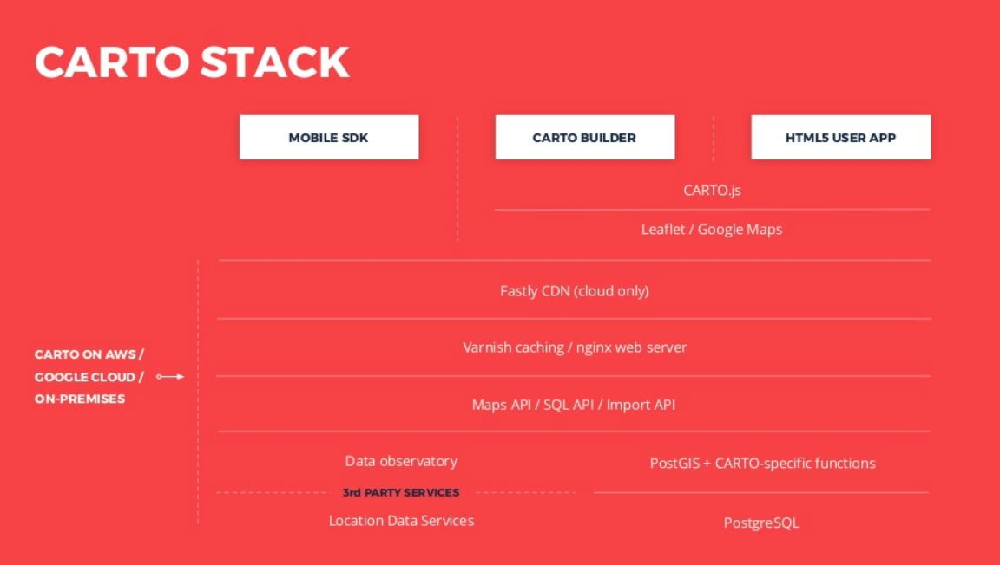

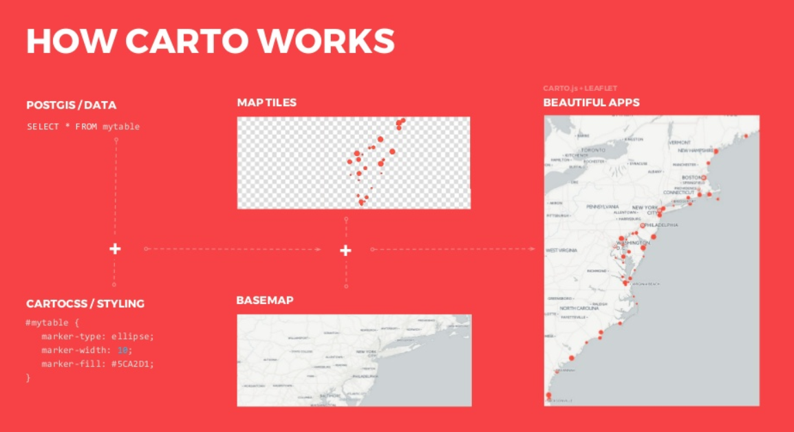


* Crear un mapa con los datos de los tweets

* Cambiar el mapa base: Comparar las siguientes opciones
	* Voyager
	* Positron
	* Dark Matter
	* Stamen Toner
	* Here Day
	* Nasa

* Adicionar el estilo que creó en mapbox como mapa base de carto

* cambiar el color, transparencia , tamaño y borde de los puntos de los tweets

* personalice el "pop-up" y la leyenda

* habilite el selector de Capa

* cambie la privacidad del mapa a "only accesible with link"

* publique el mapa

* Resultado

https://gkudos.carto.com/u/kudosg/builder/f7f21768-c27a-40ad-88d8-38ab19c6af12/embed

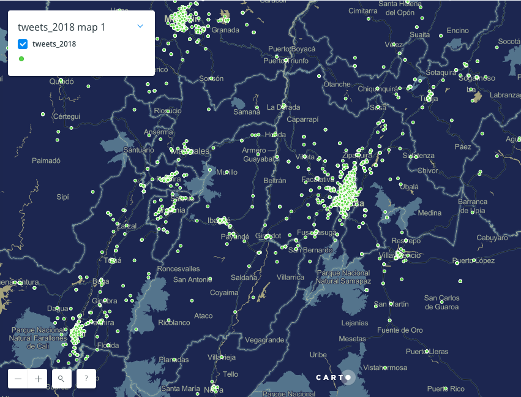


## Ejercicio 3:  Crear dashboard interactivo para el análisis de  tweets

* Cree un nuevo mapa en carto a partir de los datos de los tweets

* Adicione widget de línea de tiempo utilizando el atributo created  
	* Cambie la agregación de datos (buckets) a horas
	* Explore la línea de tiempo seleccionando un rango específico de tiempo (Ejm: 10 horas)
	* cambie el color
* Adicione widget de formula de tipo  _"feature count"_ para contar los datos que salen en pantalla
	* personalice el nombre, prefijo, sufijo y descripción según como considere necesario
* Adicione widget de categoría con e atributo "source" (aplicación desde la cual se creó el tweet )
* Repita el proceso de la categoría para los atributos lang, screen_name y place name
* cambie los colores del los puntos del tweet según como considere necesario
* personalice el pop-up de la capa de tweets    
		* click: todos los atributos
		* hover: nombre del usuario  y el texto  del tweet
* adicione la capa de departamentos, ubíquela por debajo de los tweets y cambie la simbología
* cambie la privacidad del mapa a "only accesible with link"
* publique el mapa
* explore los datos en el dashboard publicado haciendo diferentes combinaciones
* cree una nueva entrada en su blog de wordpress incluyendo el dashboard creado e incluya sus opiniones sobre el proceso.
	* Le pareciò fácil? difícil?
	* que particulares percibió de los datos luego del análisis interactivo?  
	* este tipo de dashboards serían útiles en su trabajo o profesión? ejemplos

Resultado:
https://gkudos.carto.com/u/kudosg/builder/b4fd7e58-379a-4101-9cd9-bad1111c6fc4/embed

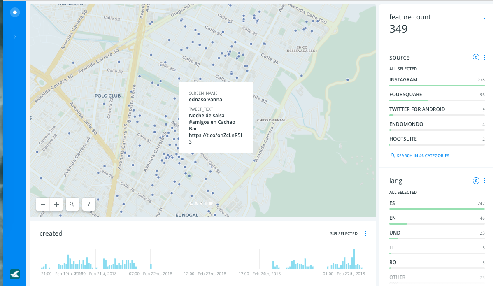


## Ejercicio 4:   Agregaciones / Densidad  con Carto

* Cree un nuevo mapa en carto a partir de los datos de los tweets y cambie la simbología agregando por cuadros o hexbins
* Cambie la simbología según como considere necesario
* publique el mapa
* resultado : https://gkudos.carto.com/u/kudosg/builder/63e02f53-fd37-43cd-a35a-74bcd00047d9/embed

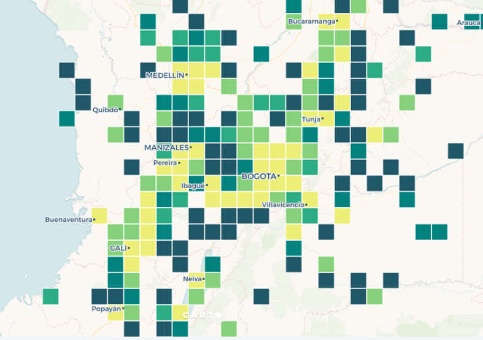


## Ejercicio 5:   Mapa de coropletas (choropleth) con Carto

* Cargue en carto el conjunto de datos statedata_shp.zip
* cree un mapa a partir de esos datos
* Simbolícelo por densidad y compare diferentes formas de clasificaciòn y rampas de color
* Adicione las etiquetas utilizando el atributo name
* explore la opción "cartocss" y revise el código generado por la herramienta
* publique el mapa
* resultado: https://gkudos.carto.com/u/kudosg/builder/ae9352da-4ad4-4941-9273-d04bf52ddda5/embed

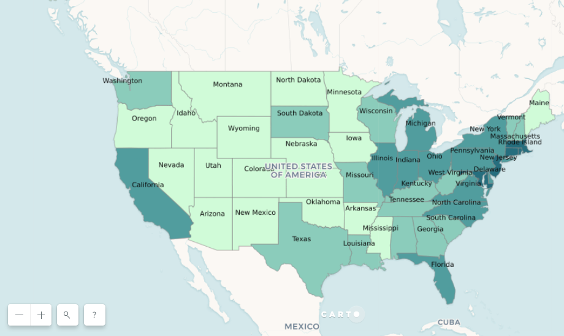


## Ejercicio 6:  Análisis espacial básico con Carto

Objetivo: Crear un mapa de municipios clasificado por la cantidad de tweets

* Cree  un nuevo mapa y adicione las capas de tweets y municipio
* seleccione la capa de municipios.
* Seleccione la opción de análisis :  "Intersect and Aggregate" 
  * https://carto.com/help/tutorials/intersect-and-aggregate/
  * capa de intersección :  tweets
  * medida: conteo
* Simbolice los municipios como coropletas  a partir del conteo de tweets
* adicione los widgets que considere necesarios para enriquecer la visualización
* resultado https://gkudos.carto.com/u/kudosg/builder/ecdf1d43-7d19-4c60-9b61-c20683818a00/embed

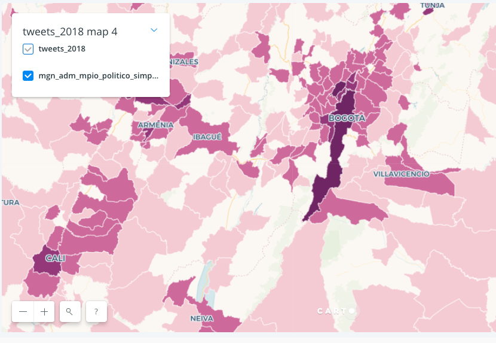

* Ejercicio para el estudiante:  Normalizar los datos!!!

## Ejercicio 7:  Enriquecer los datos con Análisis espacial utilizando Carto

**Objetivo:** 
Adicionar atributos a los datos a partir de procesos de análisis espacial.

En nuestro caso, adicionar al tweet un atributo que contenga el departamento en el que fue generado.

* Cree  un nuevo mapa y adicione la capas de departamentos y tweets_2018
* Adicione el análisis de tipo "Select Points in Polygons" (https://carto.com/help/tutorials/point-in-polygon/ utilizando como filtering layer los tweets
* Adicione widget de categoría por el atributo _source_first_depa_
* Adicine widget para conteo de datos a través del atributo source_cartodb_id
* publique el mapa
* Pregunta: cuantos tweets hay en total entre antioquia y cundinarca
* Resultado https://gkudos.carto.com/u/kudosg/builder/94b3c2bd-2856-4864-9fdb-8bd38f2869de/embed

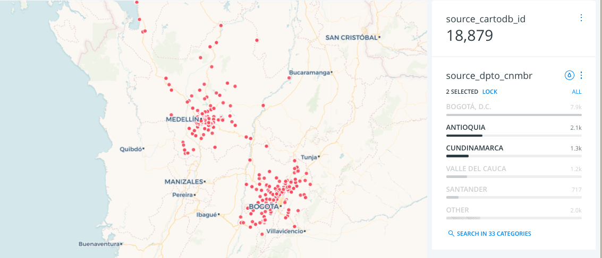


## Ejercicio 8:  Carto y Spatial SQL

Postgis

    PostGIS is an extension to the PostgreSQL object-relational database system which allows
    GIS (Geographic Information Systems) objects to be stored in the database. PostGIS
    includes support for GiST-based R-Tree spatial indexes, and functions for analysis
    and processing of GIS objects.

**Referencia de operaciones en postgis:**

http://www.postgis.org/docs/reference.html

Consultas utilizando SQL

*  Cuantos municipios tiene antioquia?

```sql
SELECT count(*) FROM mgn_adm_mpio_politico
where dpto_ccdgo = '05'
```

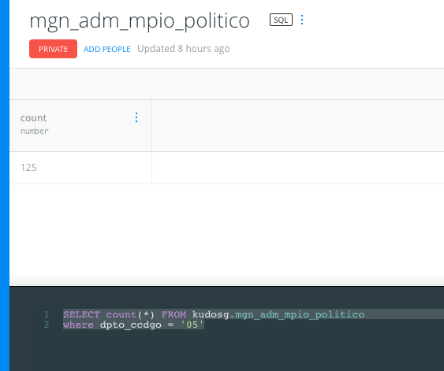

* Cuantos tweets se fueron creados con foursquare  en un radio de 2 km alrededor del centro comercial andino ?

```sql
with b as (
		select st_buffer( cdb_latlng(4.666742040, -74.05286452)::geography, 2000) as the_geom
)
select count(t.*)
from tweets_2018 as t , b
where st_intersects(t.the_geom, b.the_geom)
and t.source = 'foursquare'
```

Respuesta: 115

Ejemplo mapa:
https://gkudos.carto.com/u/kudosg/builder/2597eae1-1029-462d-80bd-ce3d3fba2538/embed

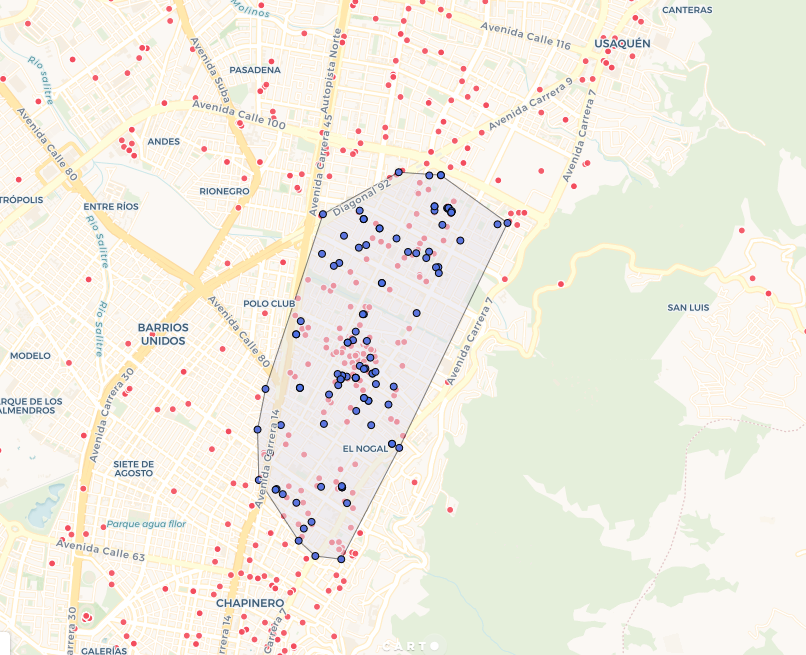


## Ejercicio 9:  Carto y Spatial SQL - Simplificación de Geometrías

ST_Simplify:  http://www.postgis.org/docs/ST_Simplify.html  

Datos sin Simplificar:

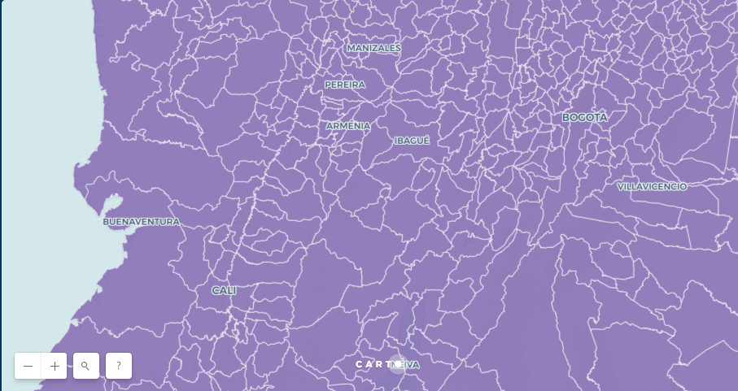


Consulta para simplificar:

```sql
SELECT st_simplify(the_geom, 0.001), mpio_cnmbr, mpio_ccnct
FROM mgn_adm_mpio_politico
```


Datos Simplificados:

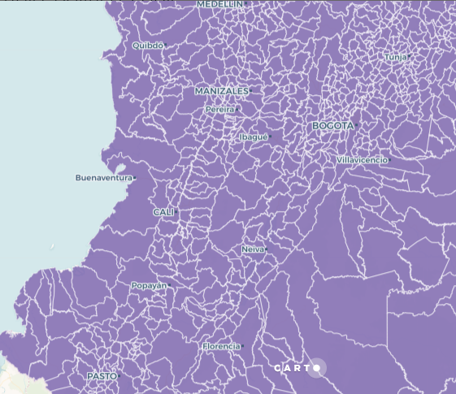

Datos Simplificados (Detalle):

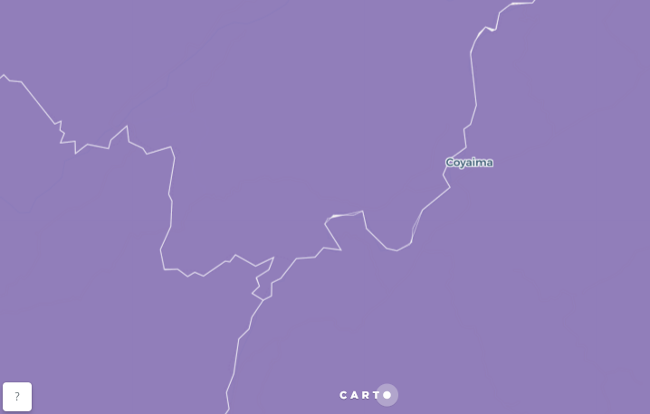

Comparación de Tamaños:


Consulta para actualizar la geometría de la tabla:

```sql
UPDATE mgn_adm_mpio_politico SET geom =  st_simplify(the_geom, 0.001)
```


Simplificar preservando la topología:

```sql
SELECT ST_SimplifyPreserveTopology(the_geom, 0.001), mpio_cnmbr, mpio_ccnct
FROM mgn_adm_mpio_politico
```


## Ejercicio 10:  Carto y Spatial SQL - Generación de geometrías

* Agrupar puntos en polígonos (convex hull) https://carto.com/help/tutorials/create-polygons-from-points/


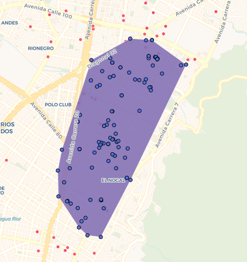

SQL Generado: 

```sql
SELECT
  row_number() over() as cartodb_id,
  ST_ConvexHull(ST_Collect(the_geom)) AS the_geom,
  count(1) as count_vals
FROM (with b as (
select st_buffer( cdb_latlng(4.666742040, -74.05286452)::geography, 2000) as the_geom 
)
select t.*
from tweets_2018 as t , b
where st_intersects(t.the_geom, b.the_geom)
and t.source = 'foursquare') _analysis_source
```

## Ejercicio 11:  Arcgis Online (Introducción)

* ArcGIS Online, Cloud-based GIS Mapping software https://www.esri.com/en-us/arcgis/products/arcgis-online/overview


Flujo de trabajo típico:

* Cargar (publicar) datos en la nube
* A partir de los datos publicados crear mapas web con la simbología.
* A partir de los mapas web generar aplicaciones. Ejm.
  * Story maps
  * Web Appbuilder
  * (Operations) Dashboard
  * etc..

* Video: Uso básico de arcgis online para publicar mapas y aplicaciones 

<a href="https://youtu.be/j7qMKTadkPU" target="_blank" >

</a>


Más información:

* Documentación sobre Arcgis Online https://www.esri.com/en-us/arcgis/products/arcgis-online/resources
* Learning Plan - ArcGIS Online Fundamentals  (ESRI Training) https://www.esri.com/training/catalog/5b733e9d2fad23092c930883/arcgis-online-fundamentals/
* Introducción a ArcGIS Online  https://learn.arcgis.com/es/projects/get-started-with-arcgis-online/
* Esri's MOOC Program - Online courses on how to apply geography for a better world. https://www.esri.com/training/mooc/


